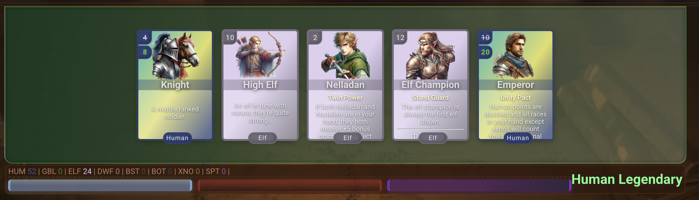
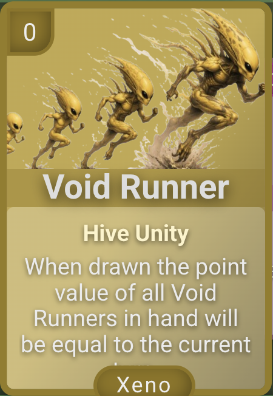
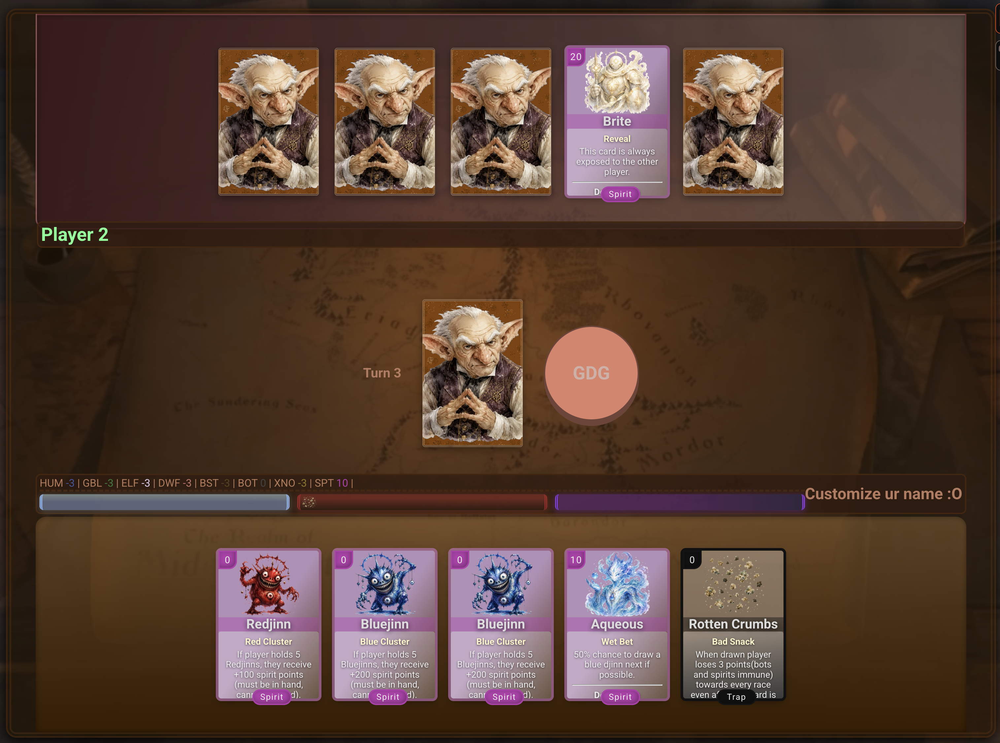

# Gobbledegook Race & Card Guide

This guide introduces Gobbledegook's eight scoring races and the special cards that shape each match. Card values and effects may change as the game continues to evolve.

Each race is scored independently. At the end of a round, a player's final score is the highest of their eight race totals after leaders, synergies, boosts, traps, and neutral effects are resolved.

## Humans

Humans are the flexible, dependable race. Commanders reward Human-heavy hands, the Emperor expands the race's scoring options, and Human-compatible hybrids count toward the Human subtotal.

**Weaknesses:** Ordinary Human cards decline quickly in value, the Emperor cannot recruit Xenos into the Human score, and the race performs best when its support pieces appear together.

### Human cards

- **Emperor — 10 points.** Doubles the Human subtotal after Commander bonuses, then adds only the printed base points of non-Human, non-Xeno cards. Their other-race ability bonuses do not carry over; for example, Pawl Barkington adds 4 to Humans even when worth 14 to Beasts.
- **Commander — 7 points.** Each Commander gives every Human-compatible card, including Commanders and hybrids, +1 point.
- **Lupin — 8 points.** Counts as both a Human and a Beast/Wolf.
- **Assassin — 5 points.**
- **Knight — 4 points.**
- **Soldier — 3 points.**
- **Scout — 2 points.**
- **Villager and Villager 2 — 1 point each.** Mechanically identical cards with different artwork.

## Goblins

Goblins are the high-risk jackpot race. Their base values are solid, the Warchief creates a route to their leader, and a pure Goblin hand containing the Goblin Lord can produce an overwhelming final score.

**Weaknesses:** Goblin Lord's Mark is worth no points and is only Goblin-adjacent, so it breaks the pure-Goblin condition. A complete Elf hand led by the Elf King can also counter the Goblin jackpot.

### Goblin cards

- **Goblin Lord — 20 points.** A pure Goblin hand becomes 1,000,000 points. If the opponent holds a pure Elf hand with the Elf King, the score becomes 500,000 and produces a draw between the two leaders.
- **Warchief — 10 points.** When drawn normally, makes Goblin Lord's Mark the next card drawn if it remains available.
- **Goblin Lord's Mark — 0 points.** Draws the Goblin Lord next if available, another Goblin if the Lord is gone, or a random card if no Goblins remain.
- **Troll — 8 points.**
- **Shaman — 7 points.**
- **Thief — 5 points.**
- **Hobgoblin — 4 points.**
- **Bokoblin — 2 points.**

## Elves

Elves have the strongest conventional leader multiplier and several internal combo engines. Twin and Bard bonuses are calculated before the Elf King's multiplier, giving carefully assembled hands an enormous ceiling.

**Weaknesses:** The Elf King's maximum multiplier requires a completely Elf-compatible hand, and many Elf cards rely on specific partners to reach their full potential.

### Elf cards

- **Elf King — 15 points.** Doubles Elf points in a mixed hand, triples them in an all-Elf hand, and counters the pure-Goblin jackpot.
- **Elf Champion — 12 points.** The first Elf drawn from the Elf deck.
- **High Elf — 10 points.**
- **Dark Elf — 9 points.**
- **Wood Elf — 6 points.**
- **Nadallen — 5 points.** Partners with Nelladan and receives +5 points for each Nelladan or Leon. Leon triggers the pair but does not receive Nelladan's +5.
- **Wild Elf/Forest Dweller — 4 points.**
- **Nelladan — 2 points.** Each paired Nelladan receives +5 points. A complete pair contributes +10 before the Elf King multiplier.
- **Bard Lute, Bard Flute, Bard Horn, Bard Drum, and Bard Singer — 2 points each.** Bards gain +1 per other Bard or Leon. Leon counts toward the five-card concert and its +20 Elf points but does not receive a Bard's personal bonus.

## Dwarves

Dwarves specialize in controlled draws and discard value. Several cards make the next draw a Dwarf, while the Longbeard Leader converts discarded Dwarves into final points.

**Weaknesses:** The lower half of the deck has modest base values, and maximizing the Longbeard Leader may require sacrificing otherwise useful cards during the round.

### Dwarf cards

- **Longbeard Leader — 12 points.** When drawn, makes the next card a Dwarf. It gains +5 points for each Dwarf its owner discards and, at the end of the game, each Dwarf discarded by either player.
- **Dwarf Commander — 10 points.** When drawn, makes the next card a Dwarf if one remains.
- **Alchemist — 8 points.** When discarded, has a 50% chance to make the next card a Dwarf.
- **Dwarf Warrior — 6 points.**
- **Hunter — 5 points.**
- **Traveller — 4 points.**
- **Miner — 3 points.**
- **Blacksmith — 3 points.**
- **Hobbit — 2 points.** Counts as both a Dwarf and a Human.
- **Bartender — 1 point.**

## Beasts

Beasts thrive on synergy. Their leaders normalize every Beast to a high value, Lions and Wolves form packs, Dogs pair with Humans, and the Giraffe growth chain eventually produces another leader.

**Weaknesses:** Bears lose their value when paired with another Bear, while the Giraffe chain temporarily controls its owner's draws and discards as it grows.

### Beast cards

- **Dream Destroyer — 18 points.** Makes every Beast in the hand worth 18 before pack and Dog bonuses.
- **Night Terror — 15 points.** Makes every Beast worth 15 unless Dream Destroyer overrides it at 18.
- **Rhinestone/Rhino — 12 points.** Blocks traps while held.
- **Theo Thunderpaw/Bear — 9 points.** Bears become worth zero if another Bear, or a Bear-mimicking Leon, is present.
- **Goldenmane/Lion — 8 points.** Each real Lion gains +3 for every Lion or Leon in hand; Leon contributes to the pride but does not receive this bonus.
- **Alpha Wolfbane/Wolf — 6 points.** Each real Wolf gains +2 per Wolf, Leon, or Lupin in the pack; Leon contributes but does not receive the Wolf-specific bonus.
- **Vultoor/Vulture — 7 points.**
- **Duck/Waddles — 3 points.**
- **Rat/Goliath — 1 point.**
- **Rat/Eeyore — 1 point.**
- **Rat/Lofi — 1 point.**
- **Rat/Chester — 1 point.**
- **Pawl Barkington/Dog — 4 points.** Gains +10 points when the hand contains a Human-compatible card.
- **Giraffe growth chain:** Egg Giraffe 0 → Calfy 1 → Giraffey 6 → Granffey 10 → Night Terror 15. Each stage replaces the previous form as the Giraffe matures.

## Bots

Bots combine strong base cards with dangerous Viruses. Protectron turns Viruses into assets, while A.I. strengthens all Bots and steals opposing Bot value at the end of the game. Cookies and Cookie Crumbs are doubled when applied to the Bot score, but Cookie Jar is not.

**Weaknesses:** Viruses are worth −2 without support, and an opposing A.I. can steal the card-derived value of a Bot hand before normal boost and trap adjustments.

### Bot cards

- **A.I. — 11 points.** Gives every Bot card +4, bringing Viruses to 2 points, and adds the opponent's Bot-card value to its score at the end of the game.
- **Protectron — 9 points.** If at least one Protectron is present, each real Virus receives +8 once. Every Protectron also gains +1 for each Virus or Leon; Leon does not receive +8.
- **Fae Bot — 8 points.** Counts as both a Bot and an Elf.
- **Cyborg — 8 points.** Counts as both a Bot and a Human.
- **Sawbot-3000 — 7 points.**
- **Kill Bot — 6 points.**
- **Incu Bot — 5 points.**
- **Virus — −2 points.**

## Xenos

Xenos have strong ordinary cards and the most dynamic point values in the game. Eggs mature into one of three evolving Xenos, Void Runner scales with game length, Warpstalker randomizes its group, and Nebulite strengthens its hive.

**Weaknesses:** Xeno Guard blocks its owner's boosts, Xenophobia targets the race directly, and egg evolution consumes multiple turns.

### Xeno cards

- **Xeno Guard — 20 points.** Blocks all of its owner's boosts while held.
- **Warpstalker — 10–20 points when drawn.** Every Warpstalker in the hand uses the resulting value.
- **Abyssolarian — 10 points.**
- **Celenial — 8 points.**
- **Void Runner — variable points.** Its value becomes the current turn count when drawn.
- **Nebulite — 0 points.** Gives every non-Nebulite Xeno +5 points. Multiple Nebulites do not stack.
- **Xeno growth chain:** Xeno Egg 0 → Xenovolve/Growing Xeno 0 → one remaining mature Xeno:
  - **Drainite** starts at 30 and loses 2 points at the beginning of each owner's turn.
  - **Xerandium** rerolls from 0–30 at the beginning of each owner's turn until Gobbledegook is declared.
  - **Sporax** starts at 0 and gains 2 points at the beginning of each owner's turn.

## Spirits

Spirits are a high-ceiling information and control race. Their unique cards have strong base values, the Spirit King reveals both hands, Dark Spirit prevents unwanted revelations, and five matching Djinn produce enormous fixed totals.

**Weaknesses:** Redjinn and Bluejinn are individually worth zero unless a complete cluster is assembled. Spirits also receive no Cookie, Cookie Crumb, Rotten Crumb, or Infect adjustments.

### Spirit cards

- **Spirit King — 25 points.** Reveals both players' hands while held.
- **Brite/Light Spirit — 20 points.** Always visible unless protected by Dark Spirit.
- **Darqnos/Dark Spirit — 15 points.** Prevents its owner's cards from being revealed, including exposure caused by Brite and Spirit King.
- **Glacos/Ice Spirit — 10 points.** Makes Bluejinn the next card drawn if one remains.
- **Ifrit/Fire Spirit — 10 points.** Makes Redjinn the next card drawn if one remains.
- **Aqueous/Water Spirit — 10 points.** Has a 50% chance to make the next card a Bluejinn.
- **Lighthor/Lightning Spirit — 10 points.** Has a 50% chance to make the next card a Redjinn.
- **Pangee/Earth Spirit — 10 points.**
- **Tailwos/Wind Spirit — 10 points.**
- **Bluejinn — 0 points individually.** A five-card Bluejinn or Leon-compatible hand becomes 200 Spirit points.
- **Redjinn — 0 points individually.** A five-card Redjinn or Leon-compatible hand becomes 100 Spirit points.

## Boosts

Boosts remain in a player's effect log after being discarded. A blocker suppresses their points only while active; Neutralize removes them. Charge and Growth pause, keep their earned totals, and resume gaining points on the next unblocked turn.

- **Chastity.** Blocks traps and pauses Infect without deleting its accumulated penalty. The block remains active after discard; when acquired through Switcharoo, it works only while held. Neutralize clears both the mark and Infect. Corruption can still take effect.
- **Eradicate.** When discarded, removes the Trap deck from future draws.
- **Chester.** When discarded, transforms into a random available racial legendary.
- **Gaze.** While held and unblocked, opens the remaining-card viewer.
- **Rejuvenate.** Adds +10 points to every race if boosts are unblocked when scored, even after the card is discarded.
- **Charge.** Each copy accumulates +1 Human and Bot point per unblocked complete turn. Blocking hides but does not erase earned points.
- **Growth.** Each copy accumulates +1 Goblin, Elf, and Dwarf point per unblocked complete turn. Blocking hides but does not erase earned points.
- **Feast.** Permanently adds +10 Beast points.
- **Oreo, Chocolate Chip, Thumbprint, and Oatmeal Cookie.** Each permanently adds +5 points to every race except Spirits and +10 points to Bots.
- **Cookie Crumbs.** Each copy permanently adds +3 points to every race except Spirits and +6 points to Bots.
- **Cookie Jar.** Gives +100 with exactly one Jar and four Cookies or Cookie-mimicking Leons; otherwise gives +40 per Jar in a hand containing only Boosts and Neutrals. A Trap in hand prevents either bonus. Bots receive the same Jar bonus as other races; only Cookies and Cookie Crumbs are doubled for Bots. Leon does not create a Cookie's separate draw boost.

## Traps

Traps remain in a player's effect log after being discarded. A blocker suppresses their penalties only while active; Neutralize removes them. Infect pauses, keeps its accumulated penalty, and resumes worsening on the next unblocked turn.

- **Corruption.** Blocks boosts and pauses Charge and Growth without deleting earned totals. The block remains active after discard; Neutralize clears both the mark and boosts. Chastity can still take effect.
- **Chjester.** Attempting to discard it discards a randomly selected racial legendary instead if one is held.
- **Exposed.** Reveals the player's hand until their next normal turn.
- **Sap.** Subtracts 10 points from every race if traps are unblocked when scored, even after the card is discarded.
- **Infect.** Accumulates a −1 penalty per unblocked complete turn for each copy, affecting every race except Spirits. Blocking hides but does not erase the existing penalty.
- **Rotten Cookie Crumbs.** Each copy permanently subtracts 3 points from Humans, Goblins, Elves, Dwarves, Beasts, and Xenos. Bots and Spirits are immune.
- **Xenophobia.** Permanently subtracts 10 Xeno points.
- **Lost.** Consumes the draw and turn; players protected from traps draw again instead.

## Neutrals

Neutral cards create events and unusual interactions instead of contributing an ordinary base score.

- **Neutralize.** Removes active boost, trap, and neutral effects, including accumulated counters, Chastity, and Corruption.
- **Switcharoo.** When discarded from a normal six-card hand before Gobbledegook is declared, swaps the five remaining cards between players.
- **Shuffler (Shuffle).** One copy. Discarding it from a six-card hand sends the other five cards to the discard pile without their discard abilities, deals five unrestricted replacement cards without immediate draw abilities, and ends the turn. Eggs still set up their later hatch draws. It can activate during the final turn after Gobbledegook is declared. Discarding it from seven cards removes only Shuffler, leaving six cards and no Shuffle effect.
- **Vision.** Reveals the opponent's hand for the current turn unless they are protected.
- **Echo.** Grants another draw, allows a hand of up to seven cards, and keeps the turn active until the hand returns to five.
- **Leon.** Has zero base points and belongs to all eight races. He counts toward other cards' requirements—including Dog, Bear, Elf Twins, Bards, Wolves, Lions, Jinn hands, and Cookie Jar—but does not receive those cards' personal bonuses or Bear's zero-point penalty. Race-wide effects such as Emperor/Commander, Beast leaders, Elf King, A.I., and Nebulite can still affect him. He triggers Protectron's +1 as a Virus would but does not receive the Virus-specific +8.
- **Xeno Bloom.** Permanently gives both players +15 Xeno points.
- **Xeno Blossom.** Permanently gives both players +5 Xeno points.
- **Ticktock.** Advances the turn counter by 3.
- **Tocktick.** Reduces the turn counter by 5, stopping at zero.
- **Dwarven Call.** Makes the next card drawn a Dwarf if one remains.

---

Return to the [main README](./README.md) for setup instructions, screenshots, and project information.
