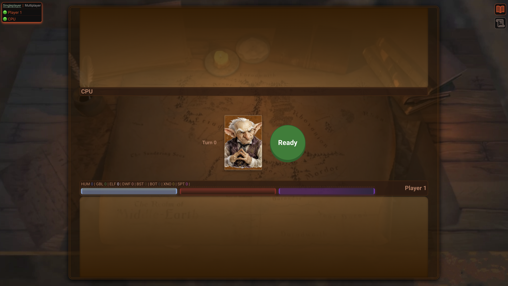
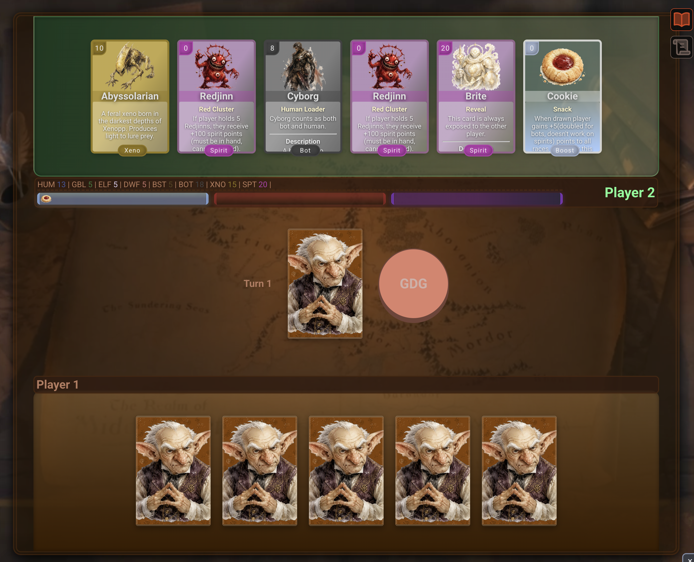
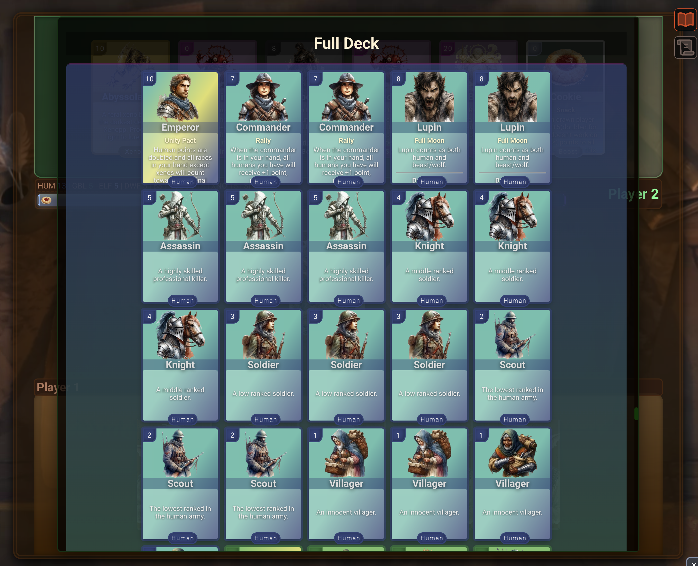
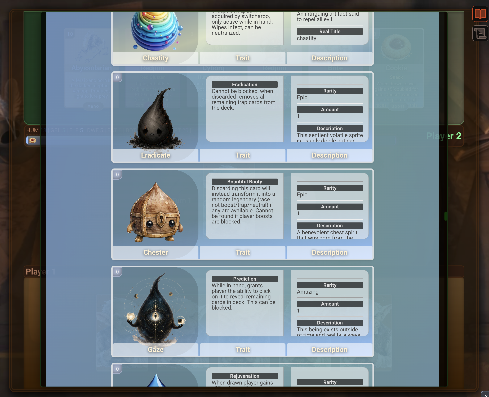
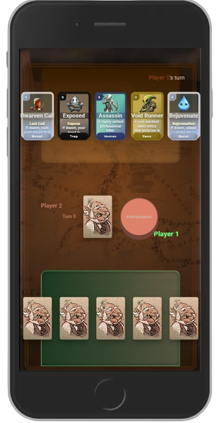
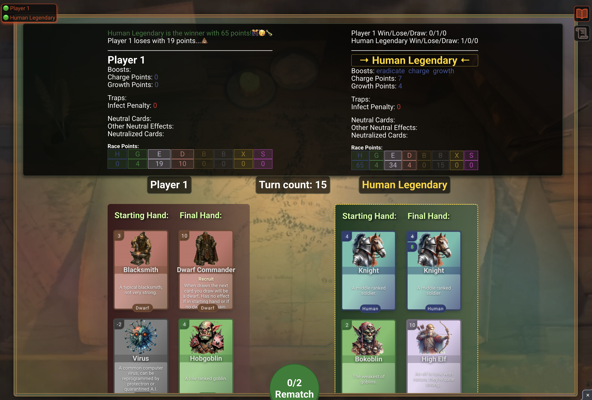
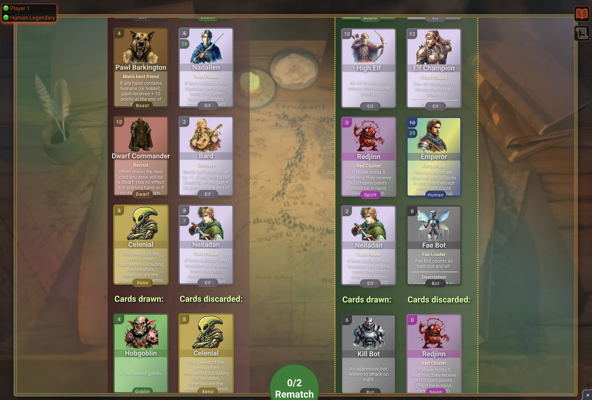

# Gobbledegook

A private fantasy card game with local singleplayer and two-player LAN modes, built with Svelte, TypeScript, Socket.IO, and Express.



## About the game

Gobbledegook is a turn-based card game in which two players build a five-card hand and compete for the strongest faction score.

Cards belong to factions and frequently modify one another through leaders, transformations, persistent bonuses, traps, and other special effects. The objective is not simply to collect five cards from the same faction: a winning hand depends on the interactions between its cards.

This is a personal project intended for private play over a local network. It is desktop-first and is not currently prepared for a public release.

## How a round works

1. Choose singleplayer or multiplayer, then select **Ready**. Multiplayer waits for both players.
2. Each player receives a five-card starting hand.
3. On a turn, the active player draws a card and discards back down to five.
4. Card effects can alter scores, reveal or exchange hands, affect future draws, or remain active after a card is discarded.
5. Once the **GDG** button becomes available, a player can declare Gobbledegook instead of drawing.
6. The opponent receives one final turn before the round ends.
7. Each faction is scored independently. A player's final score is their highest faction total after all card effects are resolved.

A round also ends if the draw pile is exhausted.

## Factions and card types

The card catalogue currently includes:

- Humans
- Goblins
- Elves
- Dwarves
- Beasts
- Bots
- Xenos
- Spirits
- Boosts
- Traps
- Neutral cards

While testing, I sometimes comment out particular decks. Check the `fullDeck` object in the `resetGame()` function in `src/lib/components/Game.svelte` to make sure every deck you want to use is active.

For a detailed breakdown of every race and its cards, see the [Race & Card Guide](./RACES.md).

For the singleplayer opponent's knowledge rules, strategy, debug controls, and tests, see the [Bot Guide](./BOT_README.md).

## Features

- Real-time, two-player LAN matches
- Local singleplayer against a balanced card-counting bot
- Randomized starting hands and draw order
- Eight independently calculated faction scores
- Card leaders and faction synergies
- Persistent boosts and penalties
- Transforming and evolving cards
- Hidden hands and temporary reveal effects
- Card library, discard pile, and remaining-card views
- End-of-round histories showing starting hands, draws, discards, and final hands
- Per-session win, loss, and draw tracking
- Connection status for both players

## Screenshots


### A hand in play



### Cards revealed to the other player


### Card library



### Boost library



### Card detail


### mobile view


### Legendary faction buff


### End-of-game results





## Running the game

### Requirements

- Node.js
- pnpm 11.21.0

### Install dependencies

```sh
pnpm install
```

### Configure the Socket.IO address

The client currently connects to a hard-coded LAN address in `src/lib/components/Game.svelte`:

```ts
let socket = io('http://192.168.2.14:6912', { autoConnect: false });
```

Change this value to the address of the computer that will run the server. Singleplayer does not connect to this address or require `server.js`.

### Build and start

```sh
pnpm build
node server.js
```

The Express and Socket.IO server listens on all network interfaces on port `6912`.

Open the following address on both players' devices:

```text
http://<server-ip>:6912
```

Only the first two connections receive active player slots.

## Development commands

| Command | Description |
| --- | --- |
| `pnpm dev` | Starts the Vite development server |
| `pnpm host` | Starts Vite and exposes it to the local network |
| `pnpm check` | Runs Svelte and TypeScript checks |
| `pnpm test:bot` | Runs the standalone bot strategy tests |
| `pnpm build` | Builds the client into `public/` and copies the server assets |
| `pnpm preview` | Previews the production build |

The Vite development server and multiplayer server are both currently configured to use port `6912`, so the production build-and-run workflow is the simplest way to test a complete multiplayer game.

## Project structure

```text
src/
├── lib/
│   ├── components/     Game board and supporting UI
│   ├── helpers/        Shared utilities
│   └── stores/         Player state, card data, and faction decks
├── routes/             Application views
├── App.svelte
└── main.ts

public/                  Built client and card artwork
server.js                Express and Socket.IO server
server/                  Source copies of static game assets
```

## Technology

- Svelte 4
- TypeScript
- Vite
- Socket.IO
- Express
- Sass

Game state is synchronized between the two clients through Socket.IO. The server keeps connection data in memory; it does not currently use a database or persist matches between sessions.

## Project status

Gobbledegook is always in active development. I am sharing the code rather than publishing stable releases, so the `main` branch is not guaranteed to be stable at every commit—although it usually is.

Some current limitations are:

- Desktop-sized screens provide the intended experience.
- Mobile play is possible but not fully optimized.
- The Socket.IO server address must currently be configured in the source.
- Development and multiplayer server ports are not separated.
- There is no automated test suite yet.
- Match state is not persisted.
- Decks may be commented out temporarily during testing; check `resetGame()` before starting a match.

## Artwork and distribution

The card artwork is AI-generated. Gobbledegook remains a personal, non-commercial project intended primarily for private play and experimentation.

No license is currently included.
